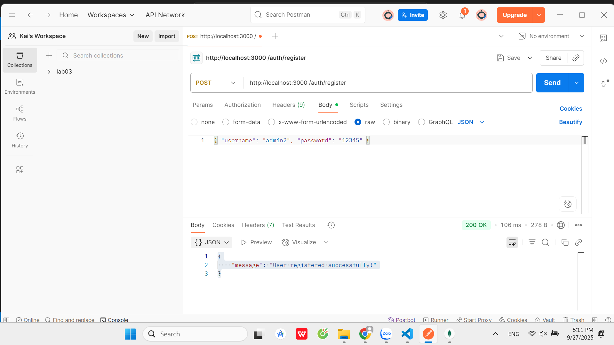
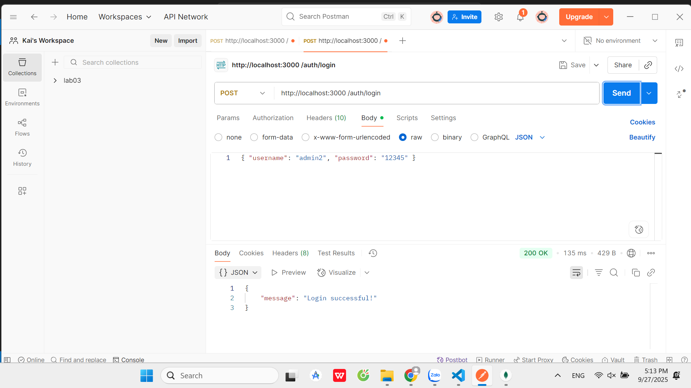
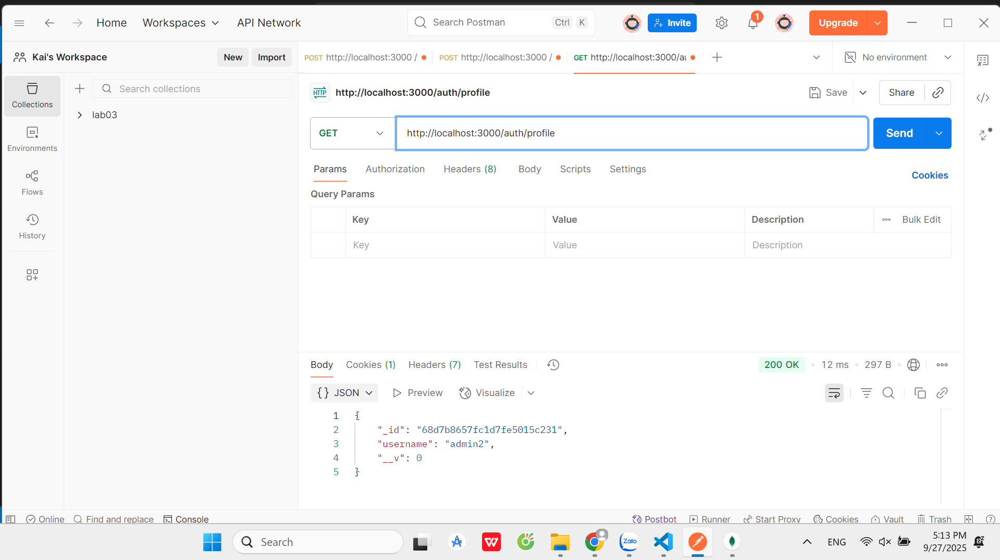
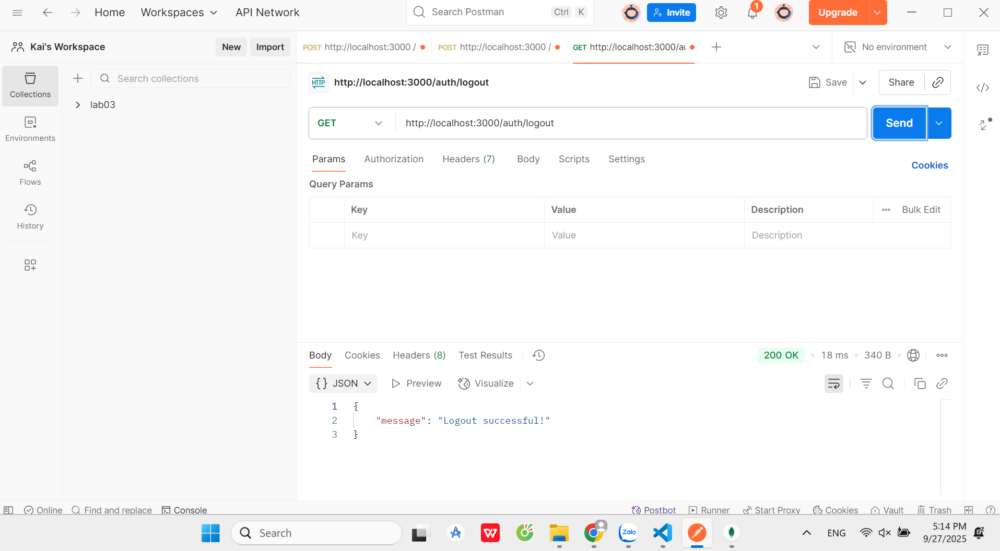
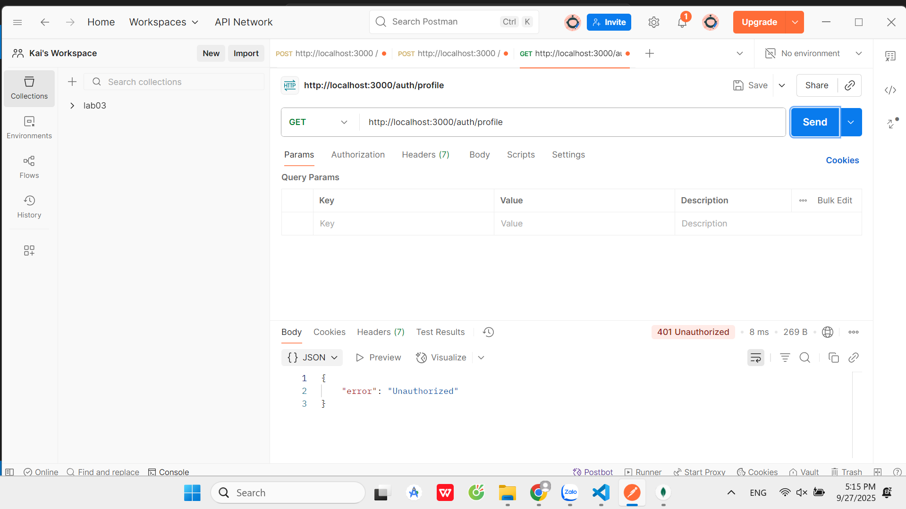

# Test local_passport_auth_service

1. Register  
POST http://localhost:3000/auth/register
Body: { "username": "admin2", "password": "12345" }

2. Login  
POST http://localhost:3000/auth/login  
Body: { "username": "admin2", "password": "12345" }

3. Profile (sau khi login)  
GET http://localhost:3000/auth/profile 

4. Logout  
GET http://localhost:3000/auth/logout

5. Profile sau khi logout  
GET http://localhost:3000/auth/profile

